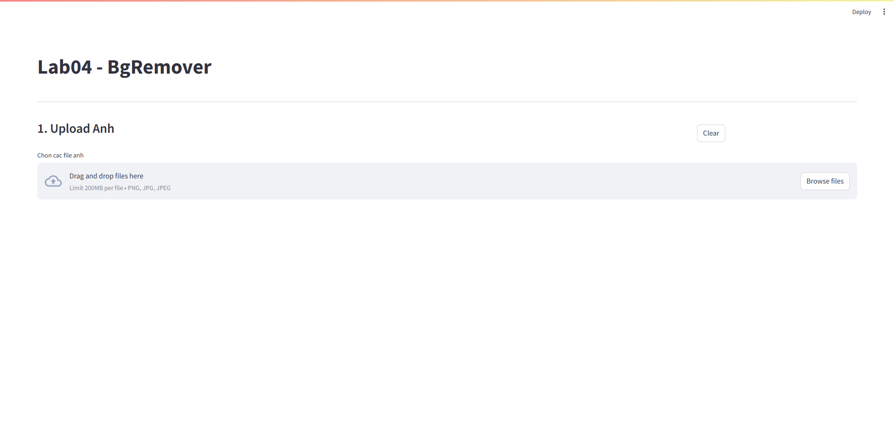
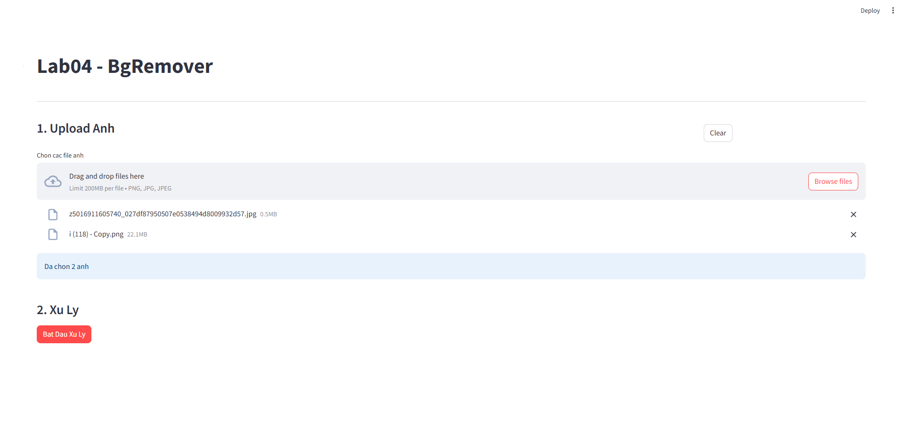
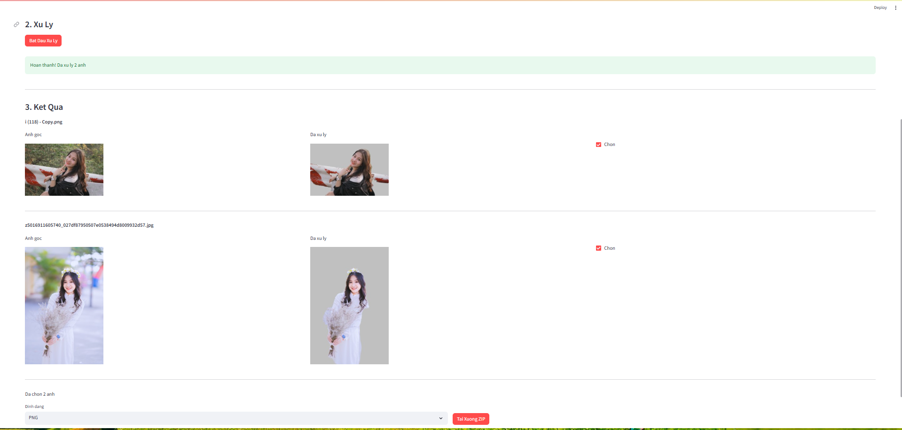

# Báo Cáo Lab Spark - Ứng dụng Backgroud Remover với Spark

## Thông Tin
- **Môn học**: IE212 - Big Data
- **Họ tên sinh viên**: Nguyễn Hà Minh Tuấn
- **MSSV**: 23521718

## Giới Thiệu
Ứng dụng loại bỏ nền ảnh sử dụng Apache Spark để xử lý song song nhiều ảnh cùng lúc. Ứng dụng được xây dựng với Streamlit và chạy trên Docker.

## Yêu Cầu Hệ Thống
- Docker Desktop đã được cài đặt và chạy
- Docker Compose

## Cấu Trúc Dự Án
```
Lab04 - BackgroudRemover/
├── app.py                      # Giao diện Streamlit
├── spark_processor.py          # Xử lý Spark
├── background_remover.py       # Loại bỏ nền với MediaPipe
├── docker-compose.yml          # Cấu hình Docker Compose
├── Dockerfile                  # Build container Streamlit
├── requirements.txt            # Thư viện Python
├── models/
│   └── selfie_segmenter.tflite # Model AI
├── input_images/               # Thư mục lưu ảnh đầu vào
└── output_images/              # Thư mục lưu ảnh đầu ra
```

## Hướng Dẫn Cài Đặt và Chạy

### Bước 1: Chuẩn bị
Đảm bảo Docker Desktop đang chạy trên máy tính.

### Bước 2: Khởi động ứng dụng
Mở terminal tại thư mục dự án và chạy lệnh:
```bash
docker compose up -d --build
```

Lệnh này sẽ:
- Build container cho ứng dụng Streamlit
- Khởi động Spark Master và 2 Spark Workers
- Khởi động ứng dụng web

### Bước 3: Truy cập ứng dụng
Mở trình duyệt và truy cập:
```
http://localhost:8501
```

### Bước 4: Sử dụng ứng dụng
1. Upload các file ảnh cần xử lý (PNG, JPG, JPEG)
2. Nhấn nút "Bat Dau Xu Ly" để xử lý với Spark
3. Xem kết quả so sánh ảnh gốc và ảnh đã loại bỏ nền
4. Chọn ảnh cần tải về và nhấn "Tai Xuong ZIP"

### Bước 5: Dừng ứng dụng
Khi hoàn thành, dừng các container bằng lệnh:
```bash
docker compose down
```

## Kết quả sử dụng ứng dụng
**Ứng dụng khởi động ban đầu**


**Upload ảnh**


**Kết quả xử lý**


## Demo


